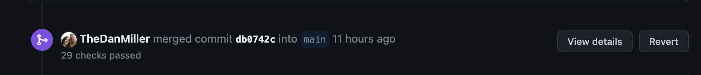

# Contributing and Maintaining
The following is a set of guidelines for contributors as well as information and instructions around our development process. The two are closely tied together and its important to understand how the work flows and not just how todo the work.

## Ways to contribute
Contributing is more than just writing code -- its anything that improves the project. All contributions are managed right here in Github. Here are some ways that anyone can help:

### Report a bug
If you are running into an issue, please take a look through [existing issues](https://github.com/coforma/swift-tech-challenge/issues). If your issue is not listed feel empowered to open a [new issue](https://github.com/coforma/swift-tech-challenge/issues/new/choose). If possible include steps to reproduce, environment information, and screenshots/videos as relevant. Please add the label ```bug``` to the item when creating the the issue.

### Suggesting enhancements
New features and enhancements are also managed via [issues](https://github.com/coforma/swift-tech-challenge/issues/new/choose). Please add the label ```enhancement``` to the item when creating the issue.

### Pull requests
A pull request (pr) is nothing more than a proposed solution to a specific problem. PRs should always reference an issue that describes the problem and contains discussion about the problem itself. Discussion on pull requests should be limited to the pull request itself, i.e. code review.

## Workflow
The ```main```branch is the development branch, meaning it contains the next version to be released. Code gets merged into the ```main``` branch from feature branches which contain bug fixes or enhancements. Branches going into ```main``` should be start with ```issue/``` or ```bug/``` followed by a short description.
- Example issue branch is ```issue/add-priority-tag-to hero```
- Example bug branch is ```bug/confirmation-workflow-not-routing-properly```

### Project board
TODO: Writeup workflow and put in image of the board. Make the board public

### Working instructions
For items being developed
1. Find an issue from the backlog, assign it to yourself, and set the status to the Dev In Progress.
2. Cut a branch from main, following appropriate naming conventions
3. Develop the work locally, committing often
4. Ensure the work has thorough tests including unit, integration, end to end, and accessibility.
5. Once the work item and testing is complete verify that no changes need made from the pre-commit hooks.
6. If there are any documentation changes please make those as well. Documentation lives in [./documentation](./documentation/) from the root of the repository.
7. Push the code from your local environment to the the repository.
8. Open a pull request, fill out the pull request template.
9. The pull request will be reviewed, and then merged or have changes requested. In some cases pull requests will be dismissed
10. Once merged the code will be scrutinized by automated actions including, linting, security, build, code quality, test coverage, and test success. From there the code will auto deploy to the staging environment should all checks pass.

### Reverting a deployment
Sometimes we have to revert changes. The best way to do that is to revert the PR on Github, rerun the actions, and then let the site redeploy.
1. Find the pull request that merged the code into the ```main``` branch
2. Scroll and find where the merge happens
3. Click the revert button

4. This will open a PR that can be merged, reverting the deployment
